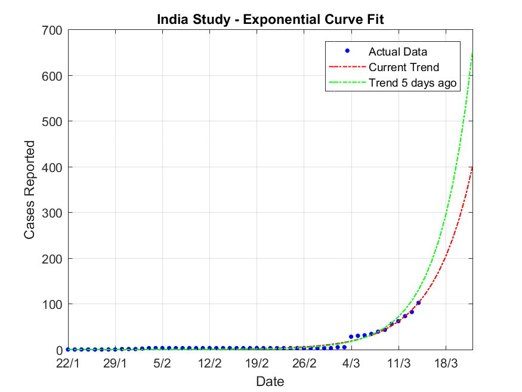

# Current Fits




### Exp

```
model1 = 
     General model Exp1:
     model1(x) = a*exp(b*x)
     Coefficients (with 95% confidence bounds):
       a =      0.0187  (0.008213, 0.02919)
       b =       0.165  (0.1539, 0.1761)

```

### 5th Order Poly

```
model2 = 
     General model Exp1:
     model2(x) = a*exp(b*x)
     Coefficients (with 95% confidence bounds):
       a =    0.004544  (-0.001348, 0.01044)
       b =      0.1966  (0.1684, 0.2248)

```